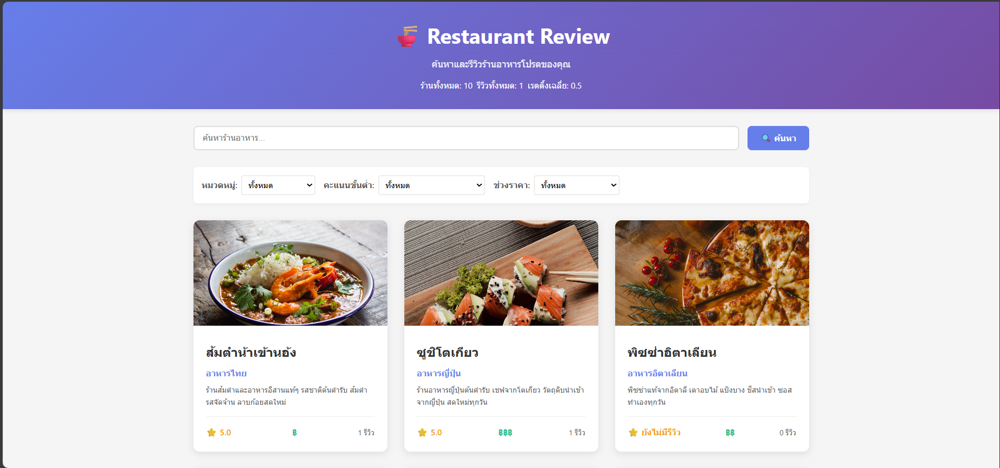
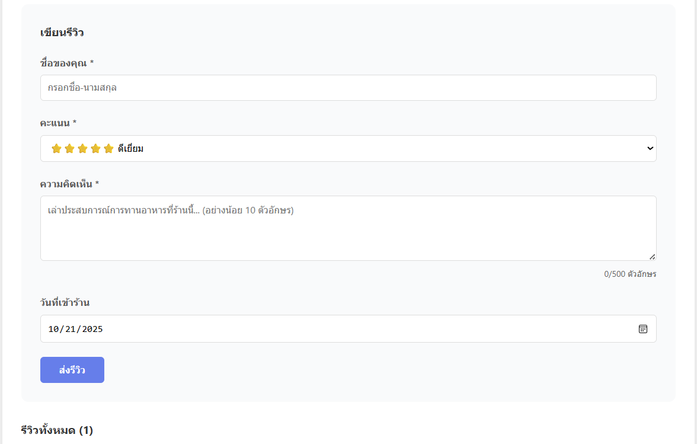
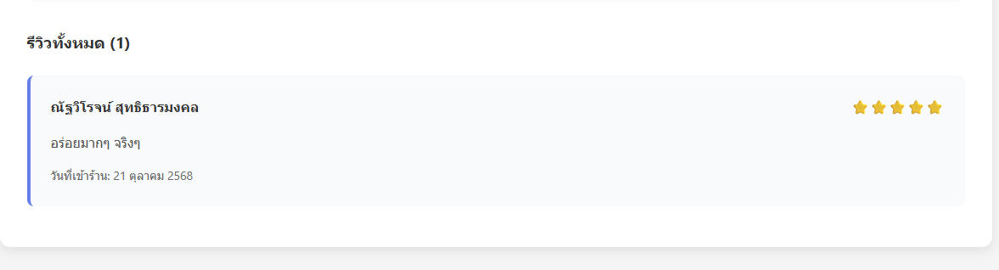

# Restaurant Review Website

## รายละเอียดโปรเจค
[อธิบายโปรเจคสั้นๆ 2-3 บรรทัด]

## เทคโนโลยีที่ใช้
- Frontend: React 18 + Vite
- Backend: Node.js + Express
- Database: JSON File Storage

## Features ที่ทำได้
### Required Features (70 คะแนน)
- [x] แสดงรายการร้านอาหาร
- [x] ค้นหาร้าน
- [x] กรองตามหมวด/rating/ราคา
- [x] ดูรายละเอียดร้าน
- [x] เพิ่มรีวิว
- [x] Validation
- [x] อัพเดท rating อัตโนมัติ

### Bonus Features (ถ้ามี)
- [ ] Sort restaurants
- [ ] Responsive design
- [ ] Animations

## วิธีติดตั้งและรัน

### Backend
\`\`\`bash
cd backend
npm install
cp .env.example .env
npm run dev
\`\`\`

### Frontend
\`\`\`bash
cd frontend
npm install
npm run dev
\`\`\`

## API Endpoints
- GET `/api/restaurants` - ดึงรายการร้านทั้งหมด
- GET `/api/restaurants/:id` - ดึงร้านตาม ID
- POST `/api/reviews` - เพิ่มรีวิว
- GET `/api/stats` - ดึงสถิติ

## Screenshots
### หน้าแรก

### รายละเอียดร้าน

### ฟอร์มรีวิว

## ผู้พัฒนา
- ณัฐวิโรจน์ สุทธิธารมงคล
- 67543210026-0
- voltvolt.nut@gmail.com

## License
MIT License